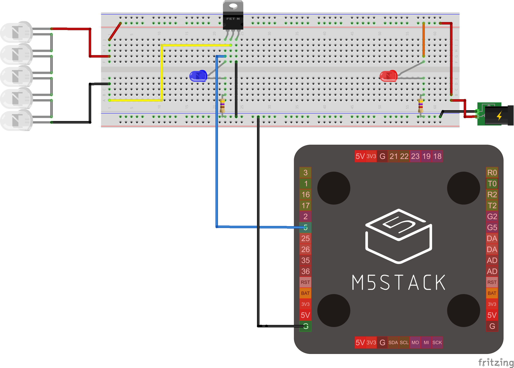
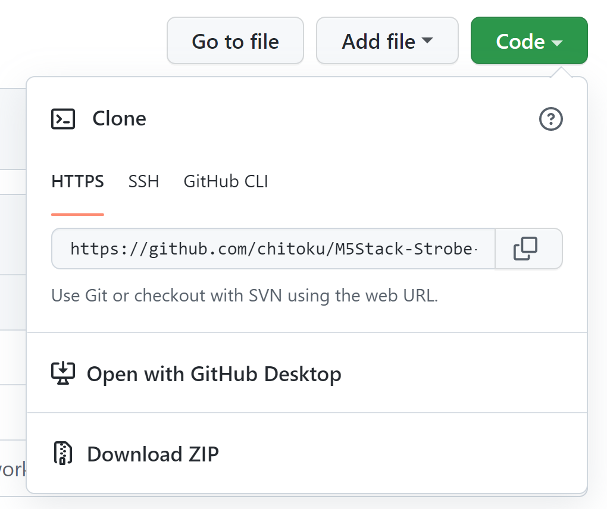

# M5Stack-Strobe-Controller
M5Stack to control LED strips to create strobe light effect.

## Features

- Based on M5Stack 
- Can control `Frequency` and `Flashspeed (time)` independently
- Show flash pulse graph on M5Stack LCD

## How to use

### Hardware Setup

### Software Setup

Run Arduino IDE on your computer, set it up for M5Stack development ([link](https://docs.m5stack.com/en/quick_start/m5core/arduino)).  It's good idea to make sure that you can upload and run a sample sketch like `FlappyBird` (File > Examples > M5Stack > Games > FlappyBird).

Then, "Download ZIP" this repository, un-zip the downloaded file and run `M5Stack-Strobe-Controller.ino`.

Select the right `Port` and `Upload` the sketch to your M5Stack.

### How to operate the UI

#### Two modes

`Center button` to switch between
- **Frequency control mode** : To adjust the frequency (`1.0` to `1000`Hz.)
- **Flash-speed control mode**  : To adjust the flash time (`5` to the interval for the set frequency)

#### Value adjustment

- `Left` button to increase the value.
- `Right` button to decrease the value.

## TODO

- [ ] External trigger support